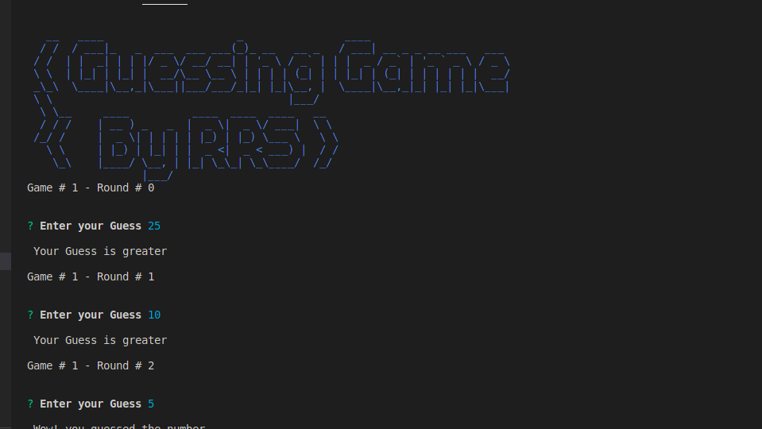
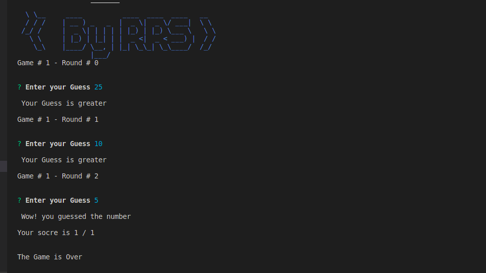

<!-- @format -->

# TypeScript-project01_Random Number Generated

## TS Project 01 – Number Guessing Game:

### Description:

This guess the number game is a short TypeScript/Node.js project that allows the
user to guess the number generated by the computer. There are also several ways
to alter the game, like adding more rounds or displaying the score. It’s quite
simple and uses the random function to generate a number.

### What we know from the description:

1. Number Game.
2. Console based
3. Computers generate number with random function
4. Users guess the number
5. Check / compare the input of user with computer generated number
6. Add Rounds
7. Display score

### Project / Game Flow:

1. Welcome message.
2. Starting round message
3. Computers generate number
4. Set the Round Number to 0
5. Set the score to 0
6. Ask user to enter his guess “Please enter your Guess between 1 – 100.”
<ul>
    <li>Check if it’s number b. Check if it’s in Range If Out of Range: Display
“Sorry it’s Out of Range”</li>
<li>Increment Round by one</li>
</ul>

7. Compare the guess and show result accordingly
<ul>
<li>If matches “Congratulations!
You guess the correct Number”. And increment score to 1</li>
<li>If Greater “your
Guess is too high”</li>
<li>If Smaller “Your guess is too low”.</li>
</ul>

8. Check the Round Number
<ul>
<li>If Round is > 3 Display “Game is Over”</li>
<li>Else
Continue to next Round by increment it by 1 and move back to step 6</li>
</ul>

9. Ask user if he is wanting to play again a. If yes move back to 2 steps b.
   Else exit the game/ end the game.
